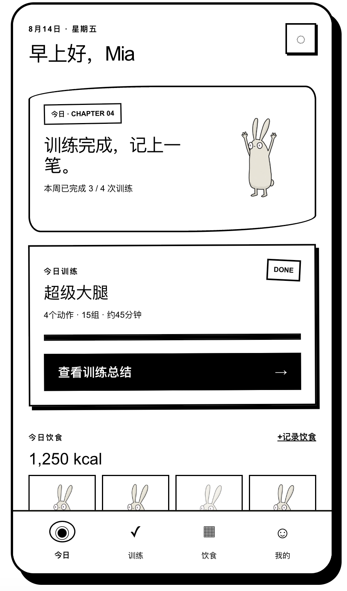
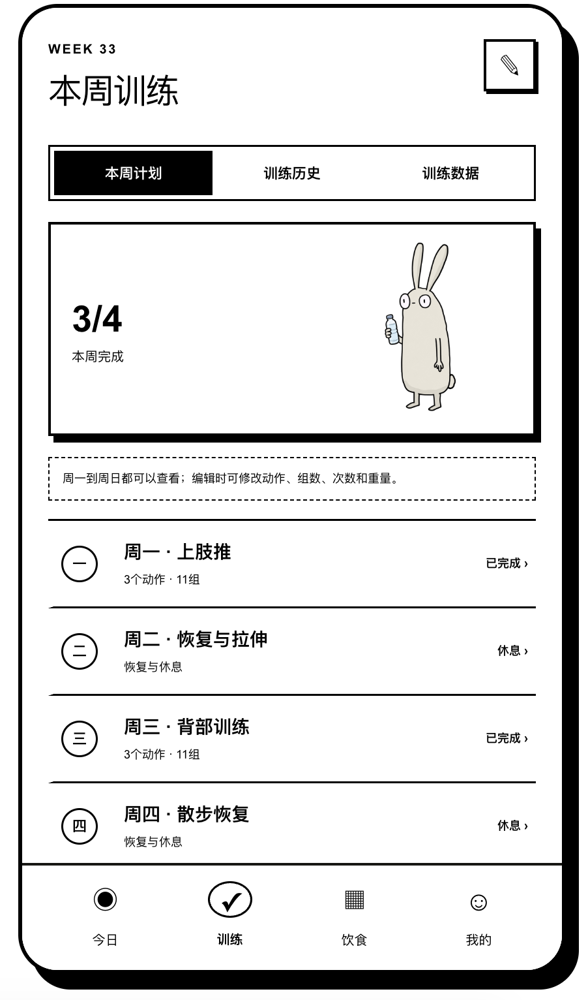
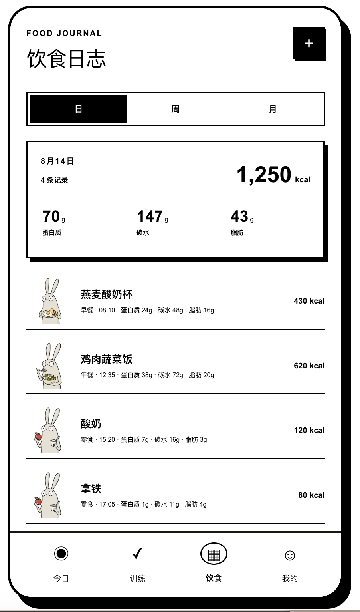
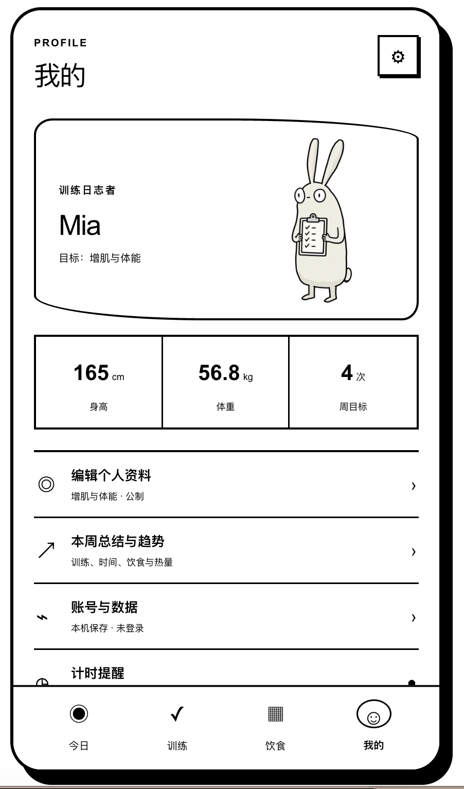
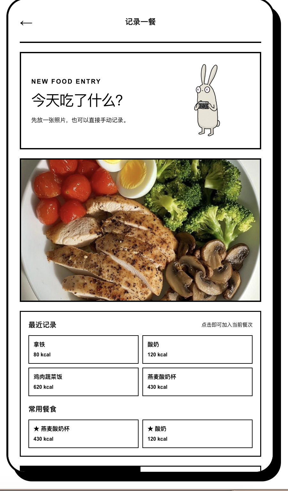
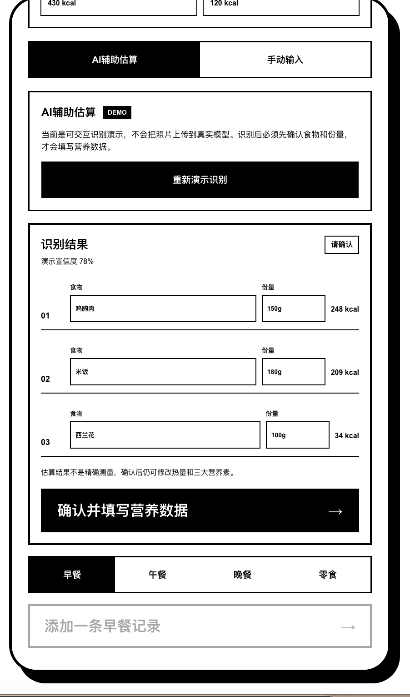
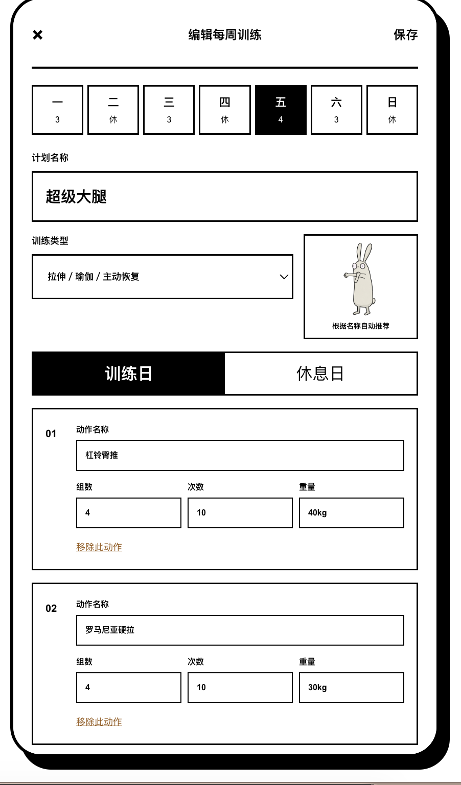

# Long Ear Log（长耳日志）1.0 Demo

移动端优先的训练计时与 AI 饮食识别 PWA。产品使用纯黑白漫画界面和统一的兔子角色，重点是降低记录负担，不自动替用户制定训练或饮食计划。

完整的产品范围、交互规则、视觉规范、改动记录和验收标准见 [PRODUCT_V1.md](./PRODUCT_V1.md)。

## 产品概述

Long Ear Log 是一款把训练计时、训练完成记录和 AI 饮食识别整合在一起的轻量记录工具。用户可以保留自己的训练安排，在训练过程中逐组打卡；记录饮食时，只需上传食物照片，由 AI 辅助识别食物内容、预估热量和三大营养素，用户确认或修改后即可保存。

产品不强调严格计划、身体评分或连续打卡压力。它更像一本可以随手翻阅的漫画日志：兔子负责陪伴和反馈，用户始终拥有训练内容、饮食数据和记录节奏的决定权。

### 为什么做这个产品

很多健身产品将训练计划、饮食追踪和数据分析拆分在不同工具中；另一些产品虽然功能完整，但记录步骤较多，并会默认用户需要减脂、增肌或严格完成推荐计划。

Long Ear Log 希望解决三个问题：

- 训练中只需要看计时、动作和完成状态，不被其他信息打断。
- 拍照记录饮食时，由 AI 先完成食物识别和营养预估，减少手动查找与输入。
- 用户可以回顾自己的行为，但不会被产品自动评价“吃得好不好”或“训练是否合格”。

## 目标用户

- 已经有自己的训练习惯，希望自由编辑每周内容的人。
- 需要训练计时、组间休息和逐组记录的人。
- 希望通过拍照和 AI 识别快速记录热量与营养，但不想执行严格饮食计划的人。
- 喜欢轻量工具、漫画视觉和低压力反馈的人。

## 核心产品原则

1. **记录优先**：帮助用户保存实际发生的训练与饮食，不代替用户制定计划。
2. **减少操作**：常用信息集中在今日页，训练和饮食使用独立流程。
3. **允许不完整**：热量必填，三大营养素可选；休息日也是正常计划的一部分。
4. **用户确认 AI**：图片识别结果必须允许修改，Demo 不伪装成真实识别能力。
5. **避免身体评价**：不使用羞辱、补偿性运动、性别刻板印象或饮食好坏评分。
6. **视觉陪伴**：兔子是记录伙伴，不是监督者或裁判。

## 产品 Demo

### 今日与周训练

| 今日 | 本周训练 |
| --- | --- |
|  |  |

- **今日**：集中展示当天训练状态、每周完成进度和饮食概览，用户可以继续记录餐食或查看训练总结。
- **本周训练**：按周一至周日展示训练日和休息日，并提供本周计划、训练历史和训练数据三个入口。

### 饮食日志与个人资料

| 饮食日志 | 我的 |
| --- | --- |
|  |  |

- **饮食日志**：支持日、周、月三种查看方式；日视图汇总热量和三大营养素，并保留同一天的多条正餐与加餐记录。
- **我的**：展示个人目标、身高、体重和每周训练目标，并提供资料编辑、趋势、账号、数据与提醒设置。

### 餐食记录与 AI 辅助识别

| 记录一餐 | AI 辅助估算 |
| --- | --- |
|  |  |

- **记录一餐**：用户可以上传食物照片，也可以复用最近记录或常用餐食，减少重复输入。
- **AI 辅助估算**：识别食物、份量和热量后，由用户确认或修改结果，再补充可选营养数据并选择早餐、午餐、晚餐或零食。1.0 中该功能为交互 Demo，不会把照片上传到真实识别模型。

### 编辑每周训练

<p align="center">
  
</p>

- **训练计划编辑**：用户可编辑每天的名称和训练类型，在训练日与休息日之间切换，并设置每个动作的组数、次数和重量。

以上截图来自可交互 Demo。页面中的训练、饮食和用户数据均为演示内容，可在浏览器本地修改和保存。

## 信息架构

产品采用四个固定一级入口：

| 页面 | 主要内容 | 核心操作 |
| --- | --- | --- |
| 今日 | 今日训练、周完成进度、当天饮食 | 开始训练、继续记录、快速添加餐食 |
| 训练 | 周计划、历史记录、动作数据 | 编辑计划、进入训练、查看重量变化 |
| 饮食 | AI 食物识别、日/周/月饮食日志 | 拍照识别、确认营养数据、回顾热量与打卡日期 |
| 我的 | 个人资料、周总结、数据管理 | 修改资料、导出数据、查看隐私说明 |

复杂任务会进入独立全屏页面，包括训练计时、周计划编辑、饮食记录和历史详情，避免在小型弹窗中堆叠操作。

## 关键交互

### 训练记录

- 用户可以编辑周一到周日的训练名称、类型、动作、组数、次数和重量。
- 进入训练后，计时器首先占据约半屏，且必须由用户主动开始。
- 向上浏览动作时，计时器会收拢到顶部。
- 每组独立打卡；只有全部组完成后，“完成训练”按钮才会启用。
- 完成记录会进入训练历史，并用于动作数据库和重量趋势。

### 饮食记录

- 上传或拍摄食物照片后，AI 辅助识别食物名称、份量、热量、蛋白质、碳水和脂肪。
- 识别结果不会直接保存；用户需要先核对食物与份量，并可修改所有营养数据。
- 如果不使用 AI，也可以切换到手动模式，仅输入热量，三大营养素保持可选。
- 每次保存都会生成一条独立记录，不覆盖同一餐别的已有内容。
- 支持早餐、午餐、晚餐、零食以及多次加餐。
- 热量必填；蛋白质、碳水和脂肪均为可选信息。
- 日视图查看明细，周视图比较四餐记录与总热量，月视图使用兔子徽章回顾有记录的日期。

### 数据与隐私

- 训练计划、训练状态、历史记录和饮食数据保存在当前浏览器。
- 支持导出 JSON 完整备份和饮食 CSV。
- 删除本机数据需要二次确认。
- 界面明确区分“设备内保存”和“云同步未连接”。

## 视觉设计

- 仅使用黑白两色、粗线条、纸张和漫画分镜式卡片。
- 使用统一的长耳兔 IP 表达训练、饮食、完成、休息和数据状态。
- 插图采用透明背景和固定安全区，确保耳朵、手脚不会被卡片裁切。
- 用印章式兔子徽章表达“这一天有记录”，不对饮食质量进行评分。
- 不以粉色或特定训练类型定义女性用户，产品同时适用于不同性别。

## 1.0 功能

- 今日训练和饮食摘要
- 用户自定义七天训练计划
- 主动开始的训练计时器与逐组打卡
- 动态周训练目标
- 训练历史、动作数据库与重量变化趋势
- AI 图片识别食物、热量与三大营养素（1.0 为交互 Demo）
- AI 结果确认、修改与手动输入模式
- 饮食日、周、月回顾
- 简洁中文营养日摘要、四餐漫画状态与周/月兔子打卡徽章
- 本周总结与基础趋势
- 个人资料编辑、本机账号演示、JSON/CSV 导出与隐私删除
- PWA 与基础离线缓存

## 技术实现

- React 19 + TypeScript
- Vinext / Vite
- 响应式移动端界面
- Service Worker 与 PWA Manifest
- 浏览器 Local Storage 本地持久化
- Node Test 自动化检查
- 透明 PNG 兔子插图与漫画状态素材

## 本地运行

需要 Node.js 22.13 或更高版本。

```bash
npm install
npm run dev
```

打开 `http://localhost:3000/`。

## 验证

```bash
npm run build
node --test tests/*.test.mjs
```

## 1.0 边界

当前版本是前端 Demo：训练、饮食和个人资料可在同一浏览器中保存；AI 热量识别只展示“识别—确认—修改”流程；账号仅为本机演示，真实认证、跨设备云同步、生产级食物识别和图片云存储尚未接入。用户可以导出 JSON/CSV，也可以在应用内删除本机个人记录。

## 后续方向

- 接入真实账号、数据库和跨设备同步。
- 接入生产级食物识别、份量修正和营养数据库。
- 增加训练动作合并、历史重量校正和更完整的数据趋势。
- 增加数据导入和本地图片压缩。
- 在保持可选和非评价性的前提下，研究生理周期等女性健康记录能力。
